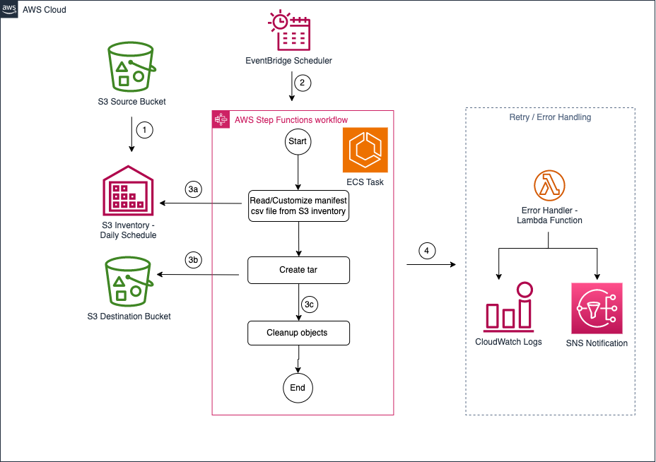
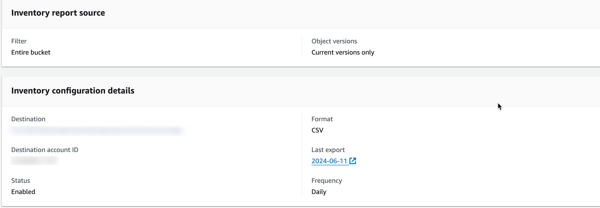
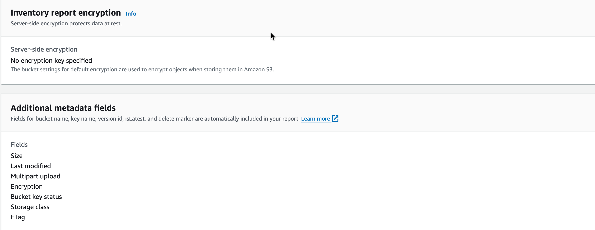
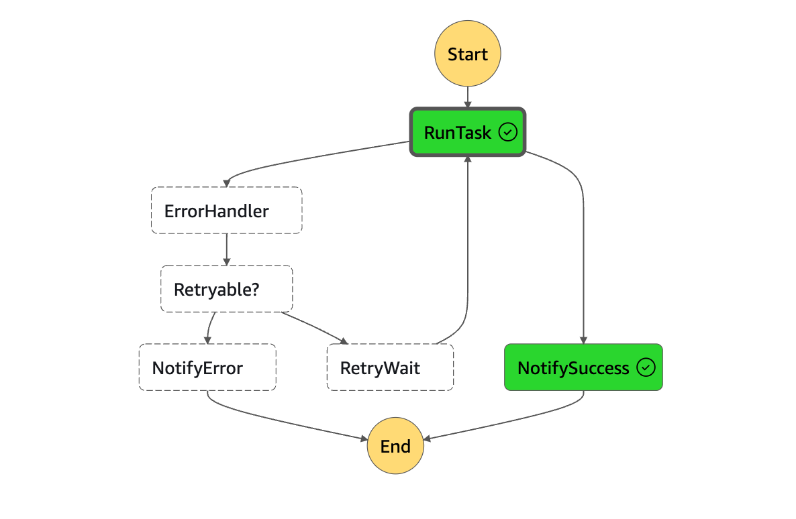
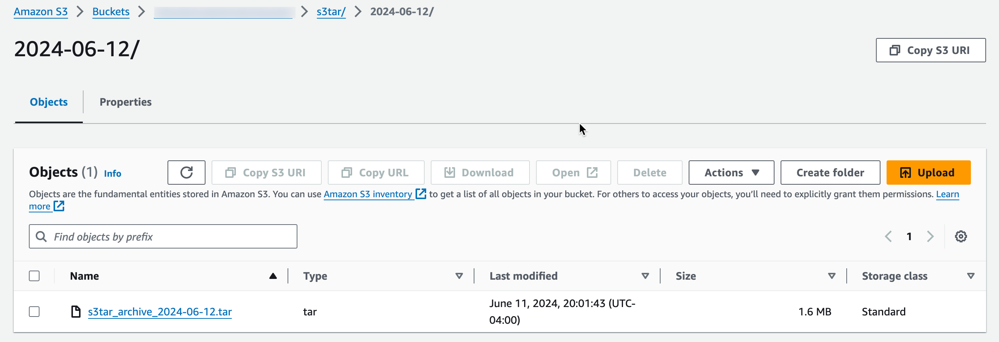
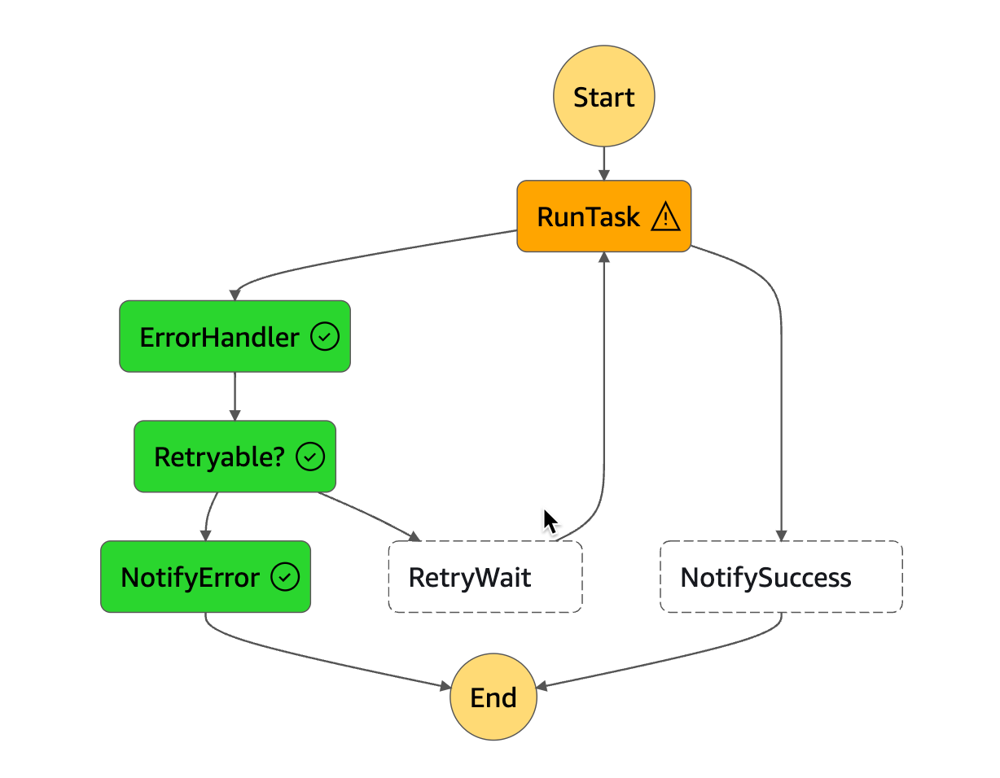

# Automating S3 object aggregation with s3tar for optimized archival storage

Automate S3 object aggregation using s3tar on Amazon ECS, AWS Step Functions, AWS Lambda, Amazon SNS, EventBridge Scheduler for archival. 

## Description
[s3tar](https://github.com/awslabs/amazon-s3-tar-tool/tree/main) is a utility tool to create tar archives of objects in S3 objects. The aggregated object tar archives can be directly placed to cost-effective S3 Glacier archival storage classes or moved using S3 Lifecycle rules for audit and compliance. The solution uses s3tar tool packaged as a Docker container and invokable from within [Amazon Elastic Container Service (ECS)](https://docs.aws.amazon.com/AmazonECS/latest/developerguide/Welcome.html) cluster task on-demand or based on a schedule. Serverless [AWS Fargate](https://docs.aws.amazon.com/AmazonECS/latest/developerguide/AWS_Fargate.html) is used for the compute and storage needs for invoking the tool. [AWS Step Function](https://docs.aws.amazon.com/step-functions/latest/dg/welcome.html) state machine workflow is used to orchestrate the ECS task invocation, retry and error handling using [AWS Lambda](https://docs.aws.amazon.com/lambda/latest/dg/welcome.html) along with notifications managed using [SNS](https://docs.aws.amazon.com/sns/latest/dg/welcome.html). An [EventBridge Scheduler](https://docs.aws.amazon.com/scheduler/latest/UserGuide/what-is-scheduler.html) is used to execute the step function workflow based on a configurable schedule.

## Architecture Diagram


## Project Components
The sample code for setting up the solution in AWS account is written using the [AWS Cloud Development Kit](https://docs.aws.amazon.com/cdk/v2/guide/getting_started.html) in Python language. The project sources are split under 4 modules
1. **s3tar_docker** - Sources to containerize s3tar tool and deploy the reusable docker image in private ECR repo in your AWS account. As this is a one-time setup, this is not included part of the CDK stack. 
2. **s3_object_aggregation_using_s3tar** - main CDK solution stack which spins up AWS Step Function workflow, ECS cluster and task, EventBridge Schedule, AWS Lambda, SNS topics and subscriptions
3. **config** - config directory holds the configuration json file which needs to be customized specific to your AWS account, region and S3 bucket names and prefixes.
4. **scripts** - helper shell scripts to validate the cdk environment dependencies for initial setup, stack deployment and destroy.

**NOTE:** Source S3 bucket with S3 Inventory configuration along destination S3 bucket/prefix for storing the S3 inventory manifest csv, generated tar are not provisioned using this CDK stack. Existing S3 bucket and prefix names to be configured in application config file before installing the stack. Also, the sample implementation uses a single AWS account and region for the automation stack along with source and destination buckets.   

## Installation
Pre-requisites:

AWS Account and IAM User is required. And then the following modules must be installed.
- AWS CLI: aws configure --profile [profile name]
- AWS CDK: cdk --version
- [jq](https://stedolan.github.io/jq/): jq --version
  Please refer to the kind guide in [CDK Workshop](https://cdkworkshop.com/15-prerequisites.html).
- Python 3.7 or later including `pip` and `virtualenv`
- Node.js 14.15.0 or later
- Docker installation to build docker image. Follow references available in [Docker documentation](https://docs.docker.com/engine/install/) or from [AWS ECS developer guide section](https://docs.aws.amazon.com/AmazonECS/latest/developerguide/create-container-image.html) based on your environment.

### ***Configure AWS Credential***

Please configure your AWS credential to grant AWS roles to your develop PC.

```bash
aws configure --profile [your-profile] 
AWS Access Key ID [None]: xxxxxx
AWS Secret Access Key [None]:yyyyyyyyyyyyyyyyyyyyyyyyyyyyyy
Default region name [None]: us-east-1 
Default output format [None]: json
...
...
```

Install the latest version of the AWS CDK Toolkit using the Node Package Manager:
```
npm install -g aws-cdk
```

Creating a Python virtual environment:
```
python3 -m venv .venv
source .venv/bin/activate
```

Install the required Python package dependencies inside the virtualenv:
```
pip install -r requirements.txt
```

**Solution Deployment Steps**

1. Update config/s3tar-app-config.json file for AWS Account, profile information and other stack configurations 
2. After installing dependencies, bootstrap CDK by executing the scripts/setup_initial.sh
    ```bash
      sh scripts/setup_initial.sh config/s3tar-app-config.json
    ```
3. The s3tar_docker/generatemanifest.sh is responsible to read the S3 inventory file generated on destination bucket prefix to create an input manifest for the s3tar tool. The last line of the shell script creates the tar using s3tar and places in the destination S3 bucket prefix per configuration. The example implementation shows the basic s3tar configuration, for customizing [options on s3tar tool](https://github.com/awslabs/amazon-s3-tar-tool/tree/main?tab=readme-ov-file#usage) for tar creation, adjust the options in the below command before creating the docker image. 
    ```bash
      /usr/local/bin/s3tar --region $destbucketregion -cvf s3://$destbuckets3tarprefix/$current_date/$finaltarname -m 's3://'$destbucketinventoryprefix$inventory_prefix's3tarinputmanifest.csv'
    ```
4. For the one-time s3tar docker image creation and push to a new private ECR repo, change directory into s3tar_docker directory and execute the s3tar_docker/create_s3tar_image_in_ecr.sh passing the application config file as an argument.
    ```bash
      cd s3tar_docker
      sh create_s3tar_image_in_ecr.sh ../config/s3tar-app-config.json
    ```
   **NOTE:** Since x86_64 architecture is chosen for s3tar release, make sure to build the docker image from a x86_64 supported machine to avoid compatibility issues. Using an AWS Cloud9 temporary dev environment can ease this step.

5. After successfully creating the private ECR repo and pushing the s3tar docker image, deploy the CDK solution stack from project root folder by executing scripts/deploy_stacks.sh file.  
    ```bash
      cd ..
      sh scripts/deploy_stacks.sh config/s3tar-app-config.json
    ```
6. Validate if all the stack components were successfully deployed by checking the deployment progress from AWS Cloudformation console.

**NOTE**: The cleanup objects stage shown in architecture is not part of the sample implementation stack as the cleanup of different objects types - Daily S3 inventory manifests, daily s3tar customized input manifests, objects in source bucket included part of the tar are handled using S3 lifecycle rule configurations to expire them based on retention period required based on use case.

## **Solution Customization Options**

**S3 Inventory Configuration Options**
1. Setup inventory configuration on source S3 bucket to run on a daily schedule and provide the destination bucket prefix as target for inventory csv file delivery. Follow [S3 user guide](https://docs.aws.amazon.com/AmazonS3/latest/userguide/configure-inventory.html) for guidance on configuring S3 inventory on the source S3 bucket. 
2. Make sure the destination bucket access permissions are configured correctly if choosing the destination bucket on different AWS account or region. 
3. Destination bucket is configured to be non-versioned and inventory report encryption id disabled for avoiding additional S3 API calls.
4. The mentioned object metadata are chosen for the implementation for including part of the inventory manifest csv - Size , Last modified , Multipart upload , Encryption , Bucket key status , Storage class  and ETag.
5. If s3 inventory is already configured or chosen with additional metadata attributes, confirm the logic on script file s3tar_docker/generatemanifest.sh logic as it uses shell "awk" commands to filter inventory csv file object keys which are of size > 0 and last modified date is from the last day. This date logic can be modified based on the use case for filtering objects applicable for including part of tar archive.
6. Sample inventory configuration on source bucket is shown below
   
   

**EventBridge Schedule Options**
1. The default EventBridge schedule is configured to run once per day at midnight UTC per the CDK stack configuration. 
2. Adjust the cron expression in s3_object_aggregation_using_s3tar/construct/s3tar_eventbridge_schedule.py as needed. Follow instructions on forming EventBridge cron expression from [documentation](https://docs.aws.amazon.com/eventbridge/latest/userguide/eb-cron-expressions.html). 
3. Adjust to a suitable schedule based on the S3 inventory schedule and when the inventory manifest gets generated and available at destination S3 bucket prefix configured.

**s3tar Release Options**
1. This sample implementation uses the linux-amd64 supported release of s3tar tool. But the tool supports other architectures like darwin-arm64 and linux-arm64. If alternate architecture release had to be used, make sure to update the s3tar_docker/Dockerfile to point to the correct [s3tar releases](https://github.com/awslabs/amazon-s3-tar-tool/releases) before creating the docker image for s3tar.

**VPC and ECS Options**
1. The sample CDK stack provisions a separate VPC and subnets for scheduling the Amazon ECS Fargate task with networking. If existing VPC in customer account has to be used, override and configure the VPC settings on s3_object_aggregation_using_s3tar/s3_object_aggregation_using_s3tar_stack.py.
2. Adjust the ECS task cpu and memory configuration based on evaluating number of files processed and average time taken for processing to increase or decrease the configurations. 

**Lambda Error Handler Options**
1. The stack is configured for specific ECS task exit code to perform retry. This retry logic based on different ECS exit codes as in [ECS developer guide](https://docs.aws.amazon.com/AmazonECS/latest/developerguide/stopped-task-error-codes.html) can be modified by adjusting in s3_object_aggregation_using_s3tar/lambda/error_handler/index.py
2. The max retry count is defaulted to 3 times which can be adjusted based on requirement in s3_object_aggregation_using_s3tar/s3_object_aggregation_using_s3tar_stack.py

## Test Data Generation
The test utility program can be used to generate random log data and seed it across date partitions in a source S3 bucket for a given number of days from current day per the argument configuration:
   ```
   ./tests/generate_test_data_in_S3.py -n 10 -f -b source-bucket-name
   ```
## Testing
1. As the state machine has the default schedule set to run at midnight UTC everyday, adjust the EventBridge schedule for a one-time test or rate based for executing the workflow. 
2. A successful run of the automation should have the workflow states as shown below and final tar file generated and placed in configured s3 tar prefix.
   
   
3. A failed execution shows the workflow states as shown below. ErrorHandler lambda evaluates if failure codes from ECS task is retryable. If yes, it retries for maximum 3 times per stack configuration with a configured wait seconds before ending the workflow after SNS error notification.
   
# Clean Up
1. CDK Stack resources can be deleted by executing scripts/destroy_stacks.sh from project root
   ```bash
      sh scripts/destroy_stacks.sh config/s3tar-app-config.json
    ```
2. Delete the private ECR repo from AWS console along with the images created during the deployment.
3. Delete or expire Cloudwatch log streams created part of the CDK stack "S3tarStack" from CloudWatch console. 